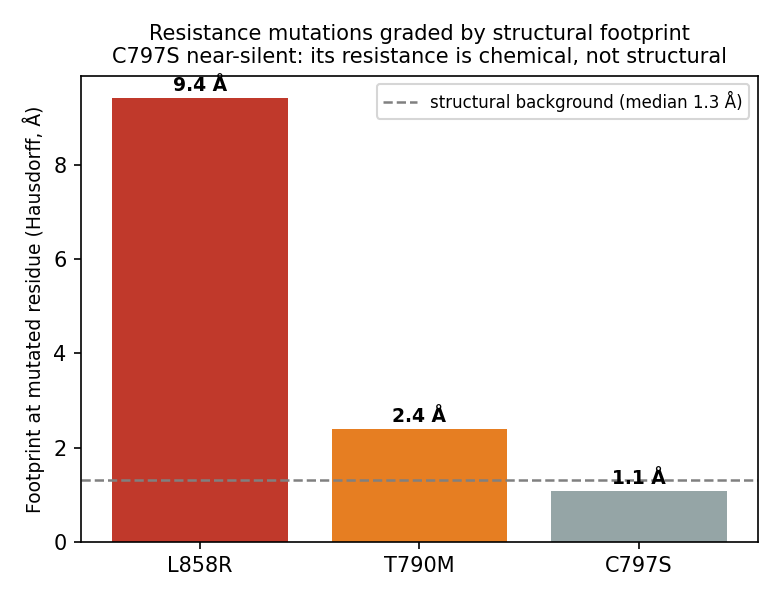

# EGFR Resistance Topology

[](https://doi.org/10.5281/zenodo.21193665)

Structural and topological footprints of EGFR targeted-therapy resistance mutations, measured with persistent homology and per-residue deformation.

A preliminary study that quantifies the structural and topological footprint that **resistance mutations** to EGFR targeted therapy in lung cancer (osimertinib) leave in the drug-binding pocket. Persistent homology and per-residue structural deformation are used to tell resistance **types** apart.

> ⚠️ Preliminary study / technical report, not a clinical tool. Based on public PDB structures.

## Key finding

Only EGFR structures bound to the same drug (osimertinib) are compared, which controls for ligand confounding. The **structural footprint** of each resistance mutation is then measured:

| Mutation | Site | Footprint (Hausdorff) | Resistance type |
|---|---|---|---|
| **L858R** | activation loop | 9.4 Å | steric: detected |
| **T790M** | gatekeeper | 2.4 Å | steric: detected |
| **C797S** | covalent anchor | 1.08 Å | chemical: **structurally silent** |

**C797S is smaller than the background (1.3 Å).** Cys→Ser is nearly isosteric, so osimertinib resistance comes *from the loss of covalent-bond chemistry, not from a change in shape*. Structural/topological descriptors therefore pick up steric resistance but are, in principle, blind to chemical resistance.



## Method

- **Structures**: PDB 6JXT (WT), 6JWL (L858R), 6JX0 (T790M), 6LUD (triple mutant), all osimertinib-bound, 2.05–2.55 Å.
- **Pocket**: 42 residues within 8 Å of the ligand (including gatekeeper 790, covalent anchor 797 and activation-loop 858).
- **Topology**: Vietoris–Rips persistent homology of the pocket heavy-atom point cloud (`ripser`) plus Wasserstein distance (`persim`), against a coordinate-noise baseline.
- **Local deformation**: per-residue symmetric Hausdorff distance after Cα superposition.

## Repository layout

```
src/data.py           PDB download, pocket definition, point-cloud extraction
src/topology.py       persistent homology, Wasserstein, noise baseline, residue attribution
src/geometry.py       superposition, per-residue Hausdorff, local topology
src/analyze.py        full pipeline -> results/ (numbers + figures)
app.py                Gradio demo (pick a mutation -> footprint, topology, interpretation)
technical_note/       technical note (for Zenodo upload)
scripts/probe_pdb.py  utility that checks the state of candidate PDB structures
```

## How to run

```bash
python -m venv .venv && source .venv/bin/activate
pip install -r requirements.txt
python -m src.analyze     # reproduce the analysis (writes results/)
python app.py             # launch the demo
```

## Data source

RCSB PDB (https://www.rcsb.org), public structures. Copyright of each PDB entry remains with its depositors / original publications.

## Citation / DOI

- **DOI (all versions):** [10.5281/zenodo.21193665](https://doi.org/10.5281/zenodo.21193665)
- **DOI (v1.0.1):** [10.5281/zenodo.21193666](https://doi.org/10.5281/zenodo.21193666)
- ORCID: [0009-0006-1926-653X](https://orcid.org/0009-0006-1926-653X)

> Lee, S. (2026). *EGFR Resistance Topology: Structural Footprints of Targeted-Therapy Resistance Mutations in the EGFR Kinase Pocket.* Zenodo. https://doi.org/10.5281/zenodo.21193665

## License

Code: MIT. Structure data follows the RCSB PDB policy.

**Status:** preliminary study (technical report, not peer-reviewed).

More projects: https://github.com/lshpy
